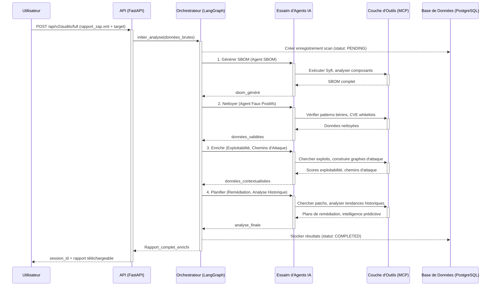
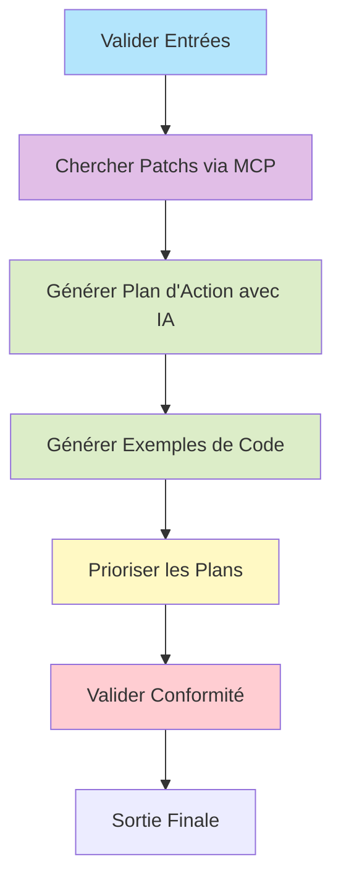

# Plateforme de Sécurité Multi-Agents TisaLabs (IA)


**TisaLabs** est une plateforme de sécurité avancée qui digitalise et automatise l'ensemble du cycle de vie de la gestion des vulnérabilités. Elle transforme les rapports bruts des scanners de sécurité en renseignements stratégiques grâce à un **système multi-agents collaboratif**, fournissant des plans de remédiation priorisés, des estimations d'effort et des correctifs de code prêts à l'emploi.
---
## 🎯 Démonstration Concrète : De la Vulnérabilité au Code Corrigé


### Exemple d'Entrée (Données Brutes de Scanner)
```json
POST /api/v2/remediation/generate
{
  "vulnerabilities": [
    {
      "id": "vuln-001-log4j",
      "cve_id": "CVE-2021-44228",
      "severity": "Critical",
      "confidence_score": 0.99,
      "affected_component": "Apache Log4j 2.14.1",
      "description": "Remote code execution in Log4j due to improper JNDI lookups...",
      "exploitability_score": 0.95
    },
    {
      "id": "vuln-002-sqli",
      "cve_id": "CWE-89",
      "severity": "High",
      "confidence_score": 0.90,
      "affected_component": "com.example.webapp:auth-service:1.2.0",
      "description": "SQL Injection vulnerability in the user login form...",
      "exploitability_score": 0.80
    },
    {
      "id": "vuln-003-xss",
      "cve_id": "CWE-79",
      "severity": "Medium",
      "confidence_score": 0.85,
      "affected_component": "com.example.webapp:search-module:2.1.0",
      "description": "Reflected Cross-Site Scripting (XSS) on the search results page...",
      "exploitability_score": 0.65
    }
  ]
}
```

### Transformation Intelligente par les Agents IA

Notre système multi-agents analyse ces données brutes et les enrichit automatiquement :

**🔍 Agent de Recherche de Patchs** : Trouve en parallèle les correctifs officiels (Log4j 2.17.1 pour CVE-2021-44228)

**🧠 Agent de Génération de Plans** : Synthétise l'information avec un LLM pour créer des actions concrètes

**💻 Agent de Génération de Code** : Transforme les conseils abstraits en exemples pratiques avant/après

**⚖️ Agent de Priorisation Stratégique** : Calcule un score composite basé sur le risque, la priorité et l'urgence

### Résultat Final Enrichi

```json
{
  "session_id": "a1b2c3d4-e5f6-g7h8-i9j0-k1l2m3n4o5p6",
  "status": "completed",
  "remediation_plans": [
    {
      "id": "plan_vuln-001-log4j",
      "vulnerability_id": "vuln-001-log4j",
      "priority": 1,
      "risk_score": 9.8,
      "timeline": "Urgent - 16h (à compléter dans les 24h)",
      "remediation_steps": [
        "**ACTION IMMÉDIATE :** Mise à jour d'Apache Log4j vers la version 2.17.1 ou plus récente",
        "Vérifier la mise à jour en inspectant la version de la bibliothèque",
        "Implémenter un filtrage des connexions sortantes..."
      ],
      "suggested_code_fix": null
    },
    {
      "id": "plan_vuln-002-sqli",
      "vulnerability_id": "vuln-002-sqli", 
      "priority": 2,
      "risk_score": 8.5,
      "timeline": "Priorité - 24h (à compléter dans les 72h)",
      "suggested_code_fix": {
        "language": "Java",
        "explanation": "Le code vulnérable concatène directement l'entrée utilisateur...",
        "vulnerable_code_example": "String query = \"SELECT * FROM users WHERE username = '\" + username + \"'...\"",
        "fixed_code_example": "String query = \"SELECT * FROM users WHERE username = ?...\"; PreparedStatement pstmt = connection.prepareStatement(query); pstmt.setString(1, username);"
      }
    }
  ],
  "executive_summary": "Une analyse automatisée de sécurité a été menée sur la plateforme 'My E-Commerce Platform'..."
}
```

**Résultats Mesurables :**
- **Priorité 1 : CVE-2021-44228 (Log4Shell)** - Score de Risque : 9.8/10 - Timeline : 16h
- **Priorité 2 : Injection SQL** - Score de Risque : 8.5/10 - Code corrigé généré automatiquement
- **Priorité 3 : XSS Réfléchi** - Score de Risque : 6.2/10 - Exemple JavaScript sécurisé fourni

---

## 🏛️ Concept et Vision Stratégique

Le paradigme traditionnel de la cybersécurité submerge les équipes d'opérations avec un volume ingérable d'alertes brutes, laissant aux analystes la tâche complexe et chronophage de trier, corréler et prioriser. **TisaLabs renverse ce modèle.**

Notre vision est de créer un **"Centre d'Opérations de Sécurité (SOC) Virtuel"**, où une équipe d'agents logiciels autonomes, chacun doté d'une expertise IA spécialisée, collabore 24/7 pour analyser, contextualiser et proposer des solutions. Ce système ne se contente pas de trouver des problèmes ; il répond à des questions stratégiques :

- *Cette alerte est-elle un vrai risque ou un faux positif ?*
- *Quel est le chemin d'attaque le plus probable qu'un adversaire pourrait emprunter ?*
- *Quel est l'impact métier réel de cette vulnérabilité dans notre environnement de production ?*
- *Quelle est la séquence optimale de corrections pour réduire le plus rapidement le risque global ?*

---

## 🏗️ Architecture Multi-Agents avec LangGraph

La plateforme est construite sur une **architecture microservices et multi-agents décentralisée**, orchestrée par le framework **LangGraph** et intégrant le **Model Context Protocol (MCP)** pour l'accès standardisé aux ressources externes.

### 1. Vue d'Ensemble des Couches Architecturales

```mermaid
graph TD
    subgraph "Couche d'Ingestion & d'Exposition"
        A[Sources Externes : Rapports ZAP, Syft] --> B[API Gateway (FastAPI)];
        B --> C{Orchestrateur LangGraph};
        Z[Utilisateur / UI] <--> B;
    end

    subgraph "Couche d'Analyse Intelligente (Cœur de la Plateforme)"
        C -- "Gère l'état et distribue les tâches" --> D1[🤖 Agent de Remédiation];
        C --> D2[🤖 Agent d'Exploitabilité];
        C --> D3[🤖 Agent d'Analyse Historique];
        C --> D4[🤖 Agent de Faux Positifs];
        C --> D5[🤖 Agent des Chemins d'Attaque];
        C --> D6[🤖 Agent de Génération SBOM];
        
        D1 <--> |Communication A2A| D2;
        D1 <--> |Communication A2A| D4;
        D2 <--> |Communication A2A| D5;
        D6 --> D2;
    end

    subgraph "Couche d'Accès aux Ressources (MCP)"
        D1 --> E1[🛠️ Bases de Données de Patchs];
        D2 --> E2[🛠️ Bases de Données d'Exploits (ExploitDB)];
        D3 --> E3[🛠️ Historique des Scans (PostgreSQL)];
        D4 --> E4[🛠️ Bibliothèque de Patterns Bénins];
        D5 --> E5[🛠️ MITRE ATT&CK, Graphes de Connaissances];
        D6 --> E6[🛠️ Syft CLI, Registres Docker];
    end
    
    style A fill:#ffcc80
    style B fill:#81d4fa
    style C fill:#4fc3f7,stroke:#0d47a1,stroke-width:2px
    style D1 fill:#c5e1a5,stroke:#558b2f
    style D2 fill:#c5e1a5,stroke:#558b2f
    style D3 fill:#c5e1a5,stroke:#558b2f
    style D4 fill:#c5e1a5,stroke:#558b2f
    style D5 fill:#c5e1a5,stroke:#558b2f
    style D6 fill:#c5e1a5,stroke:#558b2f
```

### 2. Workflow d'un Audit Complet



---

## 🤖 Spécifications Détaillées des Agents IA

### Agent de Chemins d'Attaque 
**Objectif** : Analyse les relations entre vulnérabilités et construit des chaînes d'attaque potentielles

**Composants IA** :
- **LLM (GPT-4o)** : Évaluation de plausibilité, génération d'explications
- **Réseaux de Neurones Graphiques (GNN)** : GCN, GAT, R-GCN pour l'analyse quantitative
- **RAG** : Injection de données temps réel depuis MITRE ATT&CK, NVD, CAPEC

**Ressources MCP** : Base MITRE ATT&CK, corrélateurs de vulnérabilités, analyseurs de topologie réseau

### Agent d'Exploitabilité
**Objectif** : Évalue la faisabilité pratique d'exploitation des vulnérabilités identifiées

**Composants IA** :
- **Modèles ML d'Ensemble** : Combinaison SVM, Random Forest, XGBoost
- **Intégration Threat Intelligence** : Données d'activité d'exploits en temps réel
- **Logique de Scoring CVSS** : Calcul de risques standardisés

**Ressources MCP** : Bases d'exploits, scanners de vulnérabilités, CVE databases

### Agent de Remédiation
**Objectif** : Génère des stratégies de remédiation intelligentes et contextualisées

**Composants IA** :
- **Génération de Langage Naturel (NLG)** : Instructions techniques et non-techniques
- **Apprentissage par Renforcement** : Amélioration des stratégies basées sur les retours
- **Systèmes Experts** : Contraintes métier, conformité réglementaire

**Workflow Interne LangGraph** :


### Agent de Réduction de Faux Positifs
**Objectif** : Filtre intelligemment les alertes pour éliminer les faux positifs

**Composants IA** :
- **Modèles de Classification** : SVM, Random Forest, XGBoost
- **Détection d'Anomalies** : Modèles non-supervisés pour outliers
- **NLP** : Analyse des descriptions CVE et bulletins

### Agent d'Analyse Historique
**Objectif** : Maintient un référentiel d'intelligence longitudinale sur les vulnérabilités

**Composants IA** :
- **Analyse de Séries Temporelles** : Identification de patterns temporels
- **Analytics Prédictifs** : ARIMA, LSTM, Random Forests pour prévisions
- **NLP** : Extraction d'informations depuis sources non-structurées

### Agent de Génération SBOM
**Objectif** : Création automatisée de fichiers SBOM complets

**Ressources MCP** : Syft CLI, Docker Hub/Registres, APIs Kubernetes, accès volumes/disques

---

## 🛠️ Stack Technologique Complète

| Catégorie | Technologie | Rôle dans le Projet |
|-----------|-------------|-------------------|
| **Backend Framework** | **FastAPI** | API RESTful asynchrones, auto-documentées |
| **Orchestration IA** | **LangGraph + LangChain** | Workflows multi-agents, gestion d'état |
| **Modèles de Langage** | **OpenAI GPT-4o** | Moteur de raisonnement principal |
| **Base de Données** | **PostgreSQL** | Stockage persistant audits, historiques |
| **Cache & Queues** | **Redis + Celery** | Sessions, cache, tâches arrière-plan |
| **Modélisation Données** | **Pydantic + SQLAlchemy** | Validation API et ORM base de données |
| **ML & Graphes** | **NetworkX, PyTorch Geometric, DGL** | Analyse de graphes, GNN |
| **Sécurité** | **TLS 1.3, JWT, RBAC** | Chiffrement, authentification, autorisation |
| **Conteneurisation** | **Docker + Kubernetes** | Déploiement scalable et résilient |
| **Monitoring** | **Prometheus + Grafana** | Observabilité et métriques |
| **Tests** | **Pytest + Pytest-Asyncio** | Qualité et fiabilité du code |

---

## 🚀 Types d'Audit et Workflows

### 1. Audit de Sécurité Applicative (OWASP ZAP)

**Options Utilisateur** :
- **Rapport Basique** : Résultats ZAP uniquement (pas d'enrichissement IA)
- **Analyse Renforcée** (sélection utilisateur) :
  - ☑️ Analyse des Chemins d'Attaque
  - ☑️ Évaluation d'Exploitabilité  
  - ☑️ Recommandations de Remédiation
  - ☑️ Tendances Historiques
  - ☑️ Détection de Faux Positifs
- **Enrichissement Complet** : Tous les cinq agents activés

### 2. Audit de Composition Logicielle (Syft)

**Modes Disponibles** :
- **SBOM Seulement** : Inventaire logiciel rapide (2 minutes, livraison immédiate)
- **Audit Sécurité Complet** : SBOM + analyse vulnérabilités + enrichissements IA

**Formats de Sortie** : SPDX, CycloneDX, ou les deux

---

## 📋 API Specifications Unifiées

### Endpoints Principaux

```bash
# Audit de sécurité applicative
POST /api/v2/audits/asset
{
  "zap_report": "file_or_url",
  "enhancements": {
    "attack_path": true,
    "exploitability": true,
    "remediation": true,
    "historical": false,
    "false_positive": true
  }
}

# Audit de composition logicielle  
POST /api/v2/audits/composition
{
  "target_type": "docker", # docker|source|binary
  "target_location": "nginx:latest",
  "audit_mode": "full-audit", # sbom-only|full-audit
  "sbom_format": ["spdx", "cyclonedx"]
}

# Audit combiné complet
POST /api/v2/audits/full
{
  "zap_report": "scan_results.xml",
  "composition_target": {
    "type": "docker",
    "location": "myapp:v1.0"
  }
}

# Vérification du statut
GET /api/v2/audits/{audit_id}/status

# Récupération du rapport
GET /api/v2/audits/{audit_id}/report?format=json&sections=remediation,exploitability
```

---

## ⚡ Exigences de Performance

| Métrique | Objectif | Priorité |
|----------|----------|----------|
| **Temps de Réponse API** | < 200ms (95e percentile) | Haute |
| **Traitement ZAP** | < 2 minutes | Haute |
| **Scan Syft (1GB)** | < 5 minutes | Haute |
| **Analyse Agents IA** | < 5 minutes | Critique |
| **Audits Concurrents** | 100+ simultanés | Critique |
| **Disponibilité Système** | 99.9% uptime | Critique |
| **Coût par Audit** | < $0.10 en tokens LLM | Moyenne |

---

## 🔒 Sécurité et Conformité

**Chiffrement** : TLS 1.3 pour communications, chiffrement au repos pour base de données

**Authentification** : API Keys + JWT, contrôle d'accès basé sur les rôles (RBAC)

**Validation** : Sanitisation complète des entrées, protection XSS/injection SQL

**Conformité** : GDPR, SOC 2, politiques de rétention configurables

## 📈 Observabilité et Monitoring

**Métriques Exportées** :
- Temps de traitement par agent
- Taux de réussite/échec des audits  
- Utilisation des tokens LLM
- Scores de qualité des prédictions

**Dashboards Grafana** :
- Vue d'ensemble des performances système
- Monitoring des agents IA individuels
- Analyse des coûts et de l'utilisation
- Alerting sur seuils critiques

---
